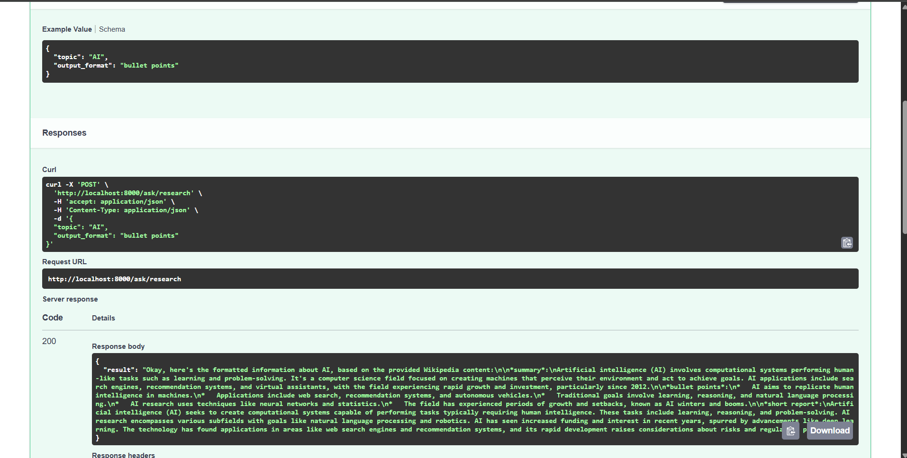

## 🛠️ Technology Stack

*   **Backend:** Python 3.x 🐍
*   **API Framework:** FastAPI 🚀
*   **AI Platform:** Julep AI 🧠
    *   Agents (LLM configuration & instructions)
    *   Tasks (Workflow definition)
    *   Executions (Running tasks)
    *   Tools (Wikipedia Integration)
*   **Deployment:** Render ☁️ (or similar PaaS)
*   **Dependencies:** `julep-ai`, `fastapi`, `uvicorn`, `python-dotenv`, `pydantic`, `pyyaml` (see `requirements.txt`)

## 🧠 Core Concepts: Julep Agent & Task

The intelligence and workflow are managed by a Julep Agent and a Julep Task working together.

### Julep Agent (`service/agent.py`)

*   **Name:** `Wikipedia Research Agent`
*   **Model:** `gemini-2.0-flash` (as specified in `service/agent.py`, adjust if different)
*   **Purpose:** To act as the LLM brain that processes the content retrieved by the Wikipedia tool. It formats this content based on layered instructions provided during its creation.
*   **Instructions (Layered):**
    1.  **Core Role:** "You are processing content fetched from Wikipedia. Format this content strictly according to the user's request ('summary', 'bullet points', 'short report')." (Derived from `agent.py` base and task instructions)
    2.  **Formatting Constraints:** "Adhere to length and style constraints: summary (3-4 sentences), bullet points (max 5, use '*'), short report (under 150 words)." (From `agent.py`)
    3.  **Error Handling/Persona:** "If the provided content is insufficient or indicates an error, state that clearly." (From `agent.py`) + Neutral, objective tone derived from the task prompt.
*   **Creation:** The agent is created (or potentially retrieved if Julep supports idempotency by name, though the current code uses `client.agents.create`) **on application startup** within `service/agent.py`. The `JULEP_AGENT_ID` environment variable is *not* strictly required by the current code logic but is good practice if you adapt the code to retrieve a pre-existing agent.

### Julep Task (`search_task.yaml`)

*   **Name:** `Wikipedia Research Task`
*   **Purpose:** To define and orchestrate the research workflow: receive input, use a tool, and prompt the agent for the final output.
*   **Input Schema:** Expects `topic` (string) and `output_format` (string enum: "summary", "bullet points", or "short report").
*   **Tools Used:** `wikipedia` (Julep's built-in integration).
*   **Workflow (`main` steps):**
    1.  **Tool Call (`tool: wikipedia`):** Executes the `wikipedia` tool using the input `topic` as the query (`$ steps[0].input.topic`).
    2.  **Prompt (`prompt:`):** This step interacts with the associated Julep Agent (LLM).
        *   **System Prompt:** *Dynamically generated* using Python f-strings (`$ f'...'`) within the YAML. It tells the agent its role, the topic, and *only the specific formatting instruction* relevant to the current request's `output_format` (e.g., only includes the 'summary' instruction if `output_format` is 'summary'). This makes the agent's task clearer.
        *   **User Prompt:** Provides the actual content fetched from the Wikipedia tool (`steps[0].output`) to the agent, clearly indicating the source and reiterating the topic and desired format.
        *   **`unwrap: true`:** Ensures the final output of the task is the direct text response from the LLM in this step, rather than a structured object.
*   **Creation:** Similar to the agent, the task is created (using the definition loaded from `search_task.yaml`) **on application startup** within `service/agent.py` and associated with the created agent.

## ⚙️ Setup and Running Locally

1.  **Prerequisites:**
    *   Python 3.9+
    *   `pip` package installer
    *   Git

2.  **Clone the Repository:**
    ```bash
    git clone https://github.com/ansuman-shukla/julep-web-search-agent.git
    cd julep-web-search-agent
    ```

3.  **Create and Activate Virtual Environment:**
    ```bash
    # Create venv
    python -m venv venv
    # Activate (Linux/macOS)
    source venv/bin/activate
    # Activate (Windows)
    .\venv\Scripts\activate
    ```

4.  **Install Dependencies:**
    ```bash
    pip install -r requirements.txt
    ```

5.  **Configure Environment Variables:**
    *   Create a file named `.env` in the project root directory.
    *   Add your Julep API key:
        ```dotenv
        JULEP_API_KEY=your_actual_julep_api_key
        JULEP_AGENT_ID=your_agent_id # Not strictly needed for current startup logic, see note below
        ```
    *   Replace `your_actual_julep_api_key` with your real key from Julep AI.
    *   **Note on `JULEP_AGENT_ID`:** The current `service/agent.py` creates a *new* agent on startup. If you modify the code to *reuse* a specific agent, you would uncomment `JULEP_AGENT_ID` and add the ID here.

6.  **Run the Application:**
    ```bash
    uvicorn main:app --reload --host 0.0.0.0 --port 8000
    ```
    *   `--reload` enables auto-reloading on code changes (useful for development).
    *   The API will be available at `http://localhost:8000`.

## 📸 Attachments 

Here's a view of the code structure before refactoring:


And after refactoring for better readability:


Example output from the API:



## 🔌 API Endpoint

### `/research`

*   **Method:** `POST`
*   **Description:** Submits a research topic and desired output format to the Julep agent task. The backend initiates a Julep execution, polls for its completion, and returns the result.
*   **Request Body:** (`application/json`) - Validated using `models/queryModels.py`
    ```json
    {
      "topic": "String: The subject to research",
      "format": "String: 'summary' | 'bullet points' | 'short report'"
    }
    ```
*   **Example Request (`curl` to the deployed Render instance):**
    ```bash
    curl -X POST "https://julep-web-search-agent.onrender.com/research" \
         -H "Content-Type: application/json" \
         -d '{
               "topic": "Theory of Relativity",
               "format": "summary"
             }'
    ```
*   **Success Response:** (`application/json`, Status Code `200`) - Validated using `models/responseModel.py`
    ```json
    {
      "result": "String: The formatted research result from the agent."
      // Note: The actual response from the current code only includes 'result'.
      // Status and execution_id could be added if needed.
    }
    ```
    *Example Result (Summary):*
    ```json
    {
      "result": "The theory of relativity usually encompasses two interrelated theories by Albert Einstein: special relativity and general relativity. Special relativity applies to all physical phenomena in the absence of gravity, while general relativity explains the law of gravitation and its relation to other forces of nature. It has been foundational to modern physics, transforming theoretical physics and astronomy during the 20th century."
    }
    ```
*   **Error Response:** Returns appropriate HTTP status codes (e.g., `422` for invalid input, `500` for Julep execution failures or internal errors) with a JSON body:
    ```json
    {
      "detail": "Error message describing the issue"
      // Or for Julep execution errors from the current code:
      // {"error": "Execution failed...", "details": "..."}
    }
    ```

## 🚀 Deployment (Render)

This application is configured for deployment on Render.

 ```bash
 https://julep-web-search-agent.onrender.com
 ```
  **Live API Endpoint:**  Use this base URL for API requests to the `/research` path. 

## 📚 `docs.julep.ai` Usage

The official Julep AI documentation ([docs.julep.ai](https://docs.julep.ai/)) was essential for this project:

*   **Core Concepts:** Understanding Agents, Tasks, Tools, Sessions (and why Tasks were chosen here), and Executions.
*   **Agent Creation:** Learning how to define `name`, `model`, `about`, and layered `instructions` using the Python SDK (`client.agents.create`).
*   **Task Definition (`YAML`):** Understanding the schema for `create_task_request.json`, defining `input_schema`, integrating `tools` (specifically `wikipedia`), and structuring the `main` workflow with `tool` and `prompt` steps.
*   **Dynamic YAML Content:** Using Python expressions (`$ f'...'`, accessing `steps[0].input`, `steps[0].output`, and `agent.name`) within the task YAML for dynamic prompt generation.
*   **Python SDK:** Using `julep.Client`, `client.tasks.create` (associating `agent_id`), `client.executions.create` to run tasks with specific `input`, and `client.executions.get` to poll for status (`succeeded`, `failed`) and retrieve `output` or `error`.
*   **API Reference:** Consulting specific method signatures and parameter requirements for the SDK functions used.

## 🤔 Challenges & Learnings

*   **Agent/Task Lifecycle:** The current approach creates the Agent and Task on *every* application startup (`service/agent.py`). While simple, this might create duplicate resources in Julep over time if not managed. A more robust approach would be to create them once, store their IDs (e.g., in environment variables or a database), and retrieve them using `client.agents.get` / `client.tasks.get` on startup. This project uses the create-on-startup method for simplicity.
*   **Dynamic Prompting in YAML:** Crafting the system prompt within `search_task.yaml` to dynamically include *only* the relevant formatting instruction based on `steps[0].input.output_format` was key to ensuring the LLM focused correctly. This required careful use of Julep's Python expression support (`$ f'...'`) and conditional logic within the f-string.
*   **Asynchronous Polling:** Julep task executions are asynchronous. The `execute_research_task` function in `service/agent.py` implements a polling loop using `client.executions.get` and `asyncio.sleep` to wait for the task to complete before returning the result to the FastAPI route.
*   **Output Parsing:** Understanding that `unwrap: true` in the task's final prompt step makes `result.output` the direct string response from the LLM, simplifying response handling in the Python code.
*   **Error Handling:** Implementing basic error handling for Julep API key issues, agent/task creation failures, and failed Julep executions, returning appropriate messages/status codes via FastAPI's `HTTPException`.
*   **Tool Usage:** Integrating the standard `wikipedia` tool was straightforward using the `tools` and `tool` step definitions in the YAML.

---
